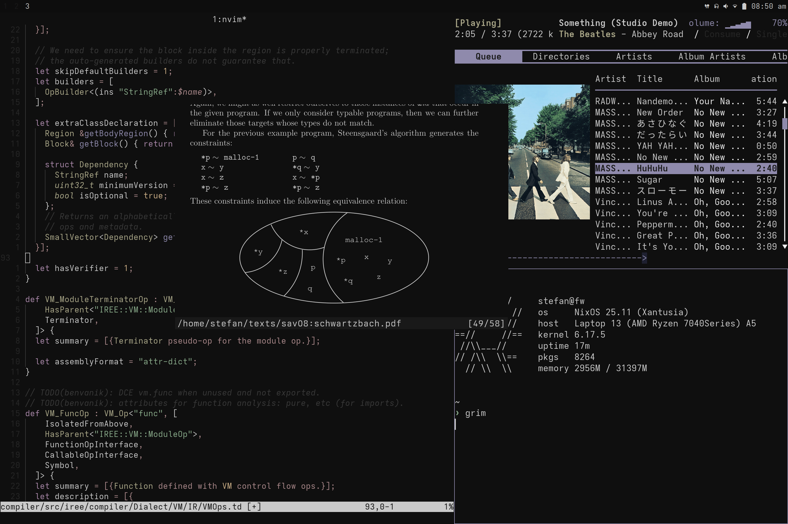

stefan's nix configs
--------------------

### Notes

- i have some strange preferences.
- everything uses an alternate keyboard layout.
- yubikey/smartcard is a soft requirement

> _old note on non-nixos configs_: I use the runit init system, and wrap user services using [turnstile](https://github.com/chimera-linux/turnstile) (which should in theory be session manager agnostic, but my [configurations](/void/services) will only work for runit). 

### Current Systems

- [form](/form): Mini itx desktop in my dorm.
    * os: NixOS
    * case: FormD T1
    * gpu: NVIDIA GeForce RTX 4080 SUPER
    * cpu: AMD Ryzen 7800X3D
    * `nixos-rebuild --flake ./home#form switch`

- [fw](/fw): Framework Laptop 13 (AMD)
    * os: NixOS
    * `nixos-rebuild --flake ./home#fw switch`

- (__NOW UNUSED__) [void](/void): Standalone home-manager setup used on two laptops.
    * os: Void Linux
    * hosts: Framework Laptop 13 (AMD), 51nb x2100
    * kernel: [linux-zen](https://github.com/zen-kernel/zen-kernel/releases)
    * prerequisites: pipewire, session manager, drivers, [turnstile](https://github.com/chimera-linux/turnstile)
    * `home-manager switch --impure --flake ~/home#void` (impure to pass env to [nixGL](https://github.com/nix-community/nixGL)
